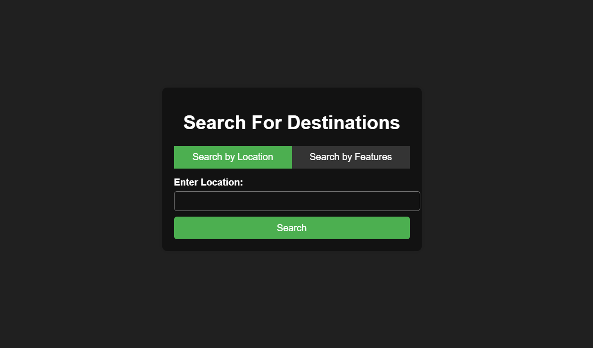

# Tour Destination Recommendation System
## Overview
This project implements a recommendation system for tour destinations, allowing users to receive personalized recommendations based on their preferences. The system uses Content-Based Filtering and Feature-Based Filtering to provide accurate suggestions.

## Features
- **Content-Based Filtering:** Recommends places based on similarities in attributes such as Name, State, City, Type, etc., using cosine similarity.
- **Feature-Based Filtering:** This project uses a Feature-Based Filtering model to recommend tourist destinations across India. It considers multiple user-input features and predicts suitable tourist places using a trained Random Forest Classifier.
- **Customizable User Input:** Users can input their preferences (e.g., city, state, type of location, etc.) to get personalized recommendations.

## Future Scope
- **Collaborative Filtering:** Implement collaborative filtering based on user history and ratings to enhance recommendations.

## Prerequisites
To run this project locally, make sure you have the following installed:

- **Python** (version 3.8 or above)
- **pip** (Python package installer)
- **Virtual Environment** (recommended for managing dependencies)
- **Python Libraries**:
  - flask
  - pandas
  - scikit-learn

## Screenshots

